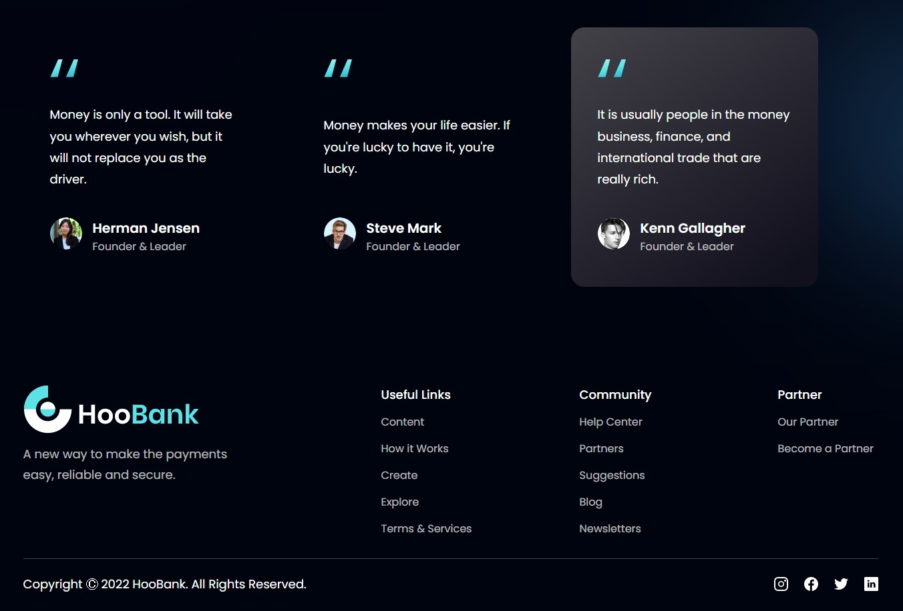

## Build a Fully Responsive Website with Modern UI/UX in React JS with Tailwind

## Documentation

DEMO: https://hoobank-tailwind.vercel.app/

[Documentation](https://tailwindcss.com/docs/installation)

## Features

- React functional components and their reusability
- React file and folder structure
- You’ll achieve mastery using Tailwind CSS
- Fundamental CSS properties to master flex
- From soft and pleasant animations to complex gradients
- Perfectly placed media queries for satisfactory responsiveness on all devices
- And at the end, you'll learn how to deploy your websites to extremely fast servers and give them a custom domain name using Hostinger

## Screenshots

